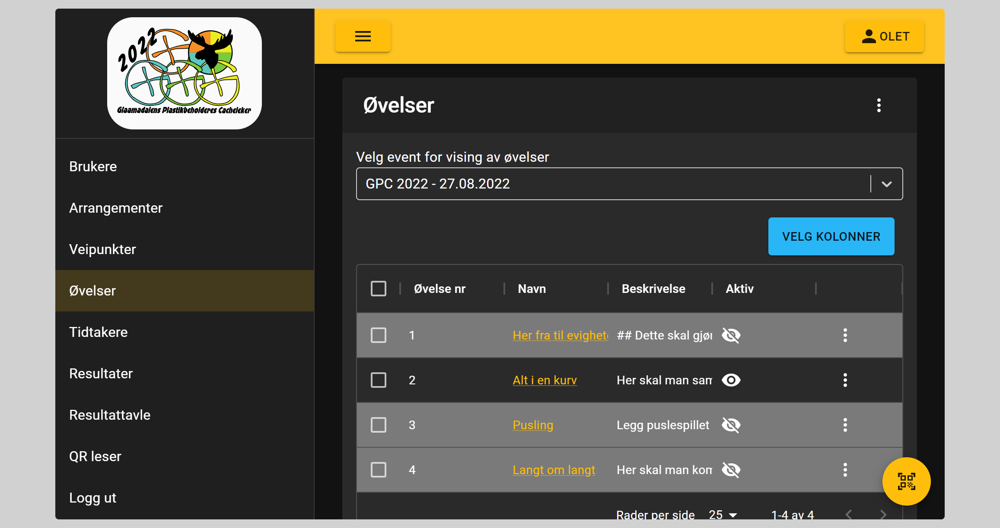
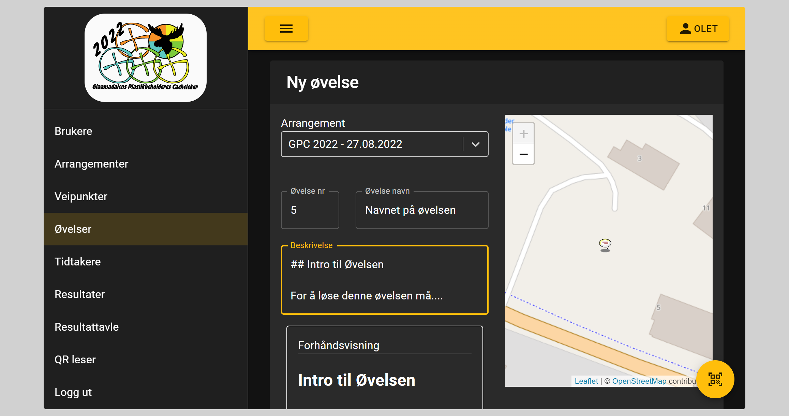
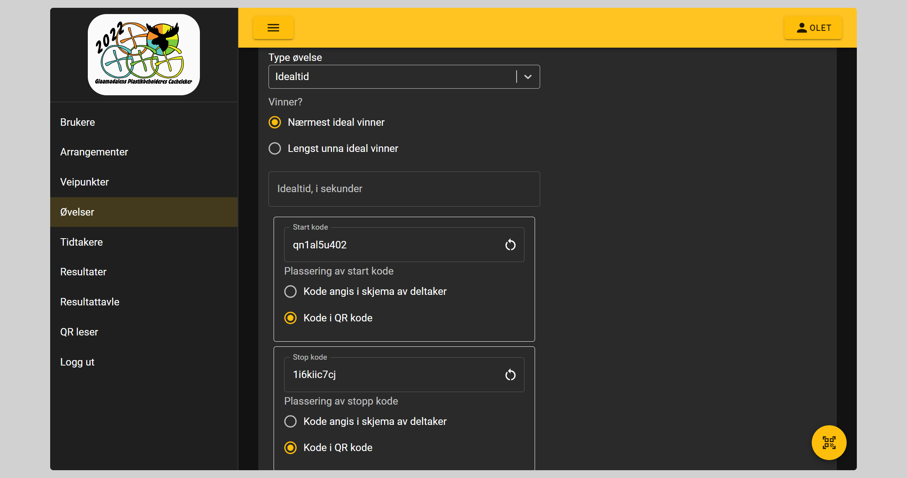

# Øvelser

## Type øvelser

- Tid
- Idealtid
- Poeng
- Lengde

## Registrering av øvelser

### Del 1

Her registeres

- Hvilket arrangement de tilhører
- Øvelse nummer
    - Neste nummer, etter antall øvelser regnes ut. Nummer kan fritt velges
- Navn på øvelsen
- Beskrivelse av øvelsen
    - Viktig at denne teksten inneholder
        - Hvordan øvelsen skal løses
        - Hva som ikke skal gjøres
    - For formatering av denne teksten, benytt Markdown
    - [Grunn syntaks for Markdown](https://www.markdownguide.org/basic-syntax/)

Ved registrering vises lokasjonen for valgte arrangement, dette for å lettere registere veipunktet på riktig sted

### Del 2

For opplysninger som laget ikke skal ha før etter at oppgaven er startet fylles inn i feltet ``Ekstra info``

Dette feltet kan for eksempel benyttes til å angi koden til en kodelås som trengs for å starte oppgaven. 
``Kode til låsen: 1234``

Videre velges type øvelse reg første avsnitt.

For at brukere skal se hvor på området øvelsen foregår velges posisjonen på kartet til høyre

### Del 3

#### Øvelser på tid

Først velges om det er lengst eller kortest tid som er den som er best.

Videre angis kodene som skal benyttes for start og stopp. Standard er at koden er en del av QR koden.
Det genereres automatisk forskjellige koder til både start og stopp til hver øvelse. Man kan velge egne koder, men også generere nye ved å trykke på oppfrisk knappen på enden av feltet

#### Øvelser på idealtid

For idealtid øvelser angis det samme som for tid øvelser, men i tillegg må idealtiden angis. Idealtid angis i sekunder

#### Lengde og poeng øvelser

For disse øvelsene er det kun om høyest/lavest, kortest/lengst som skal velges
